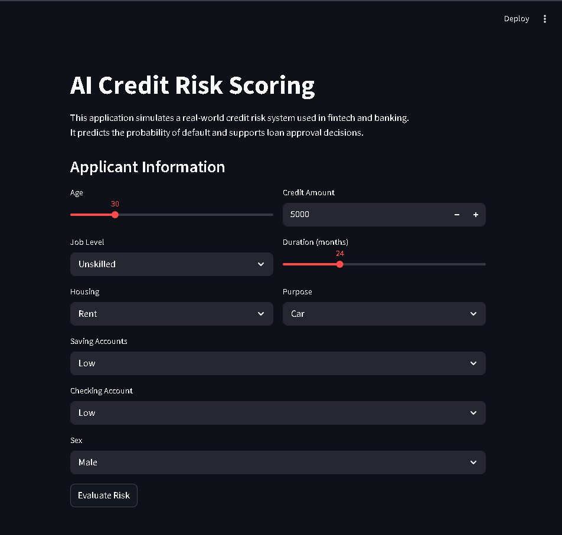
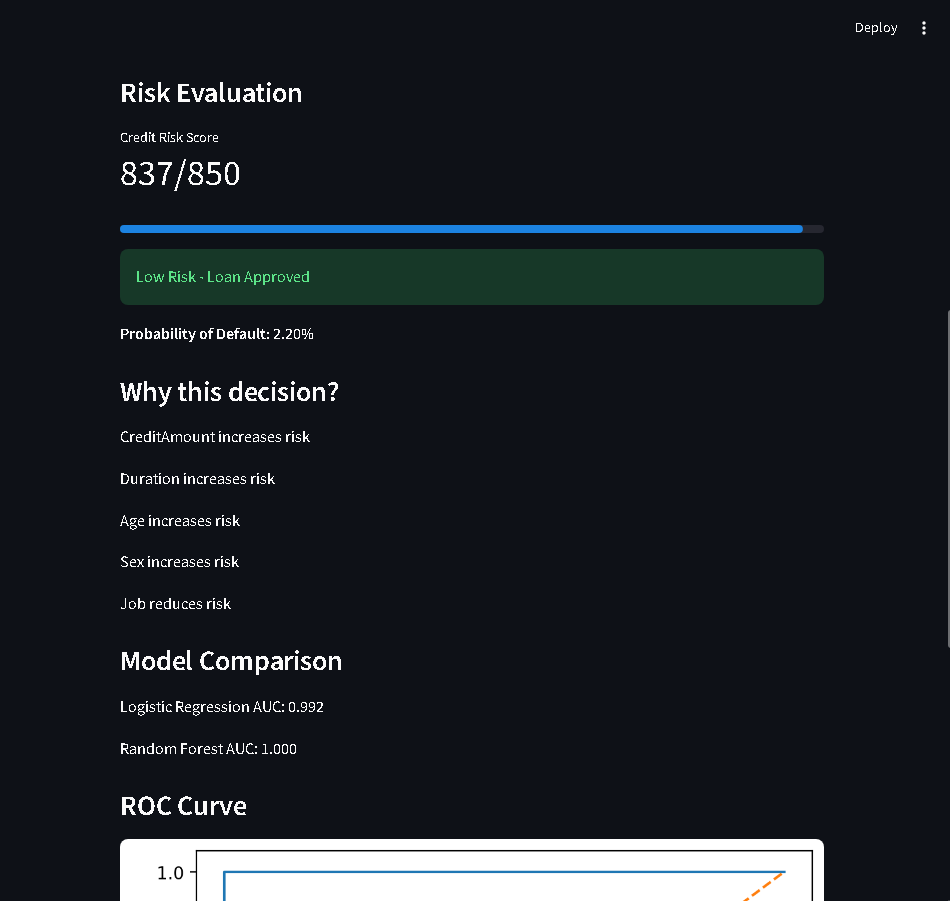
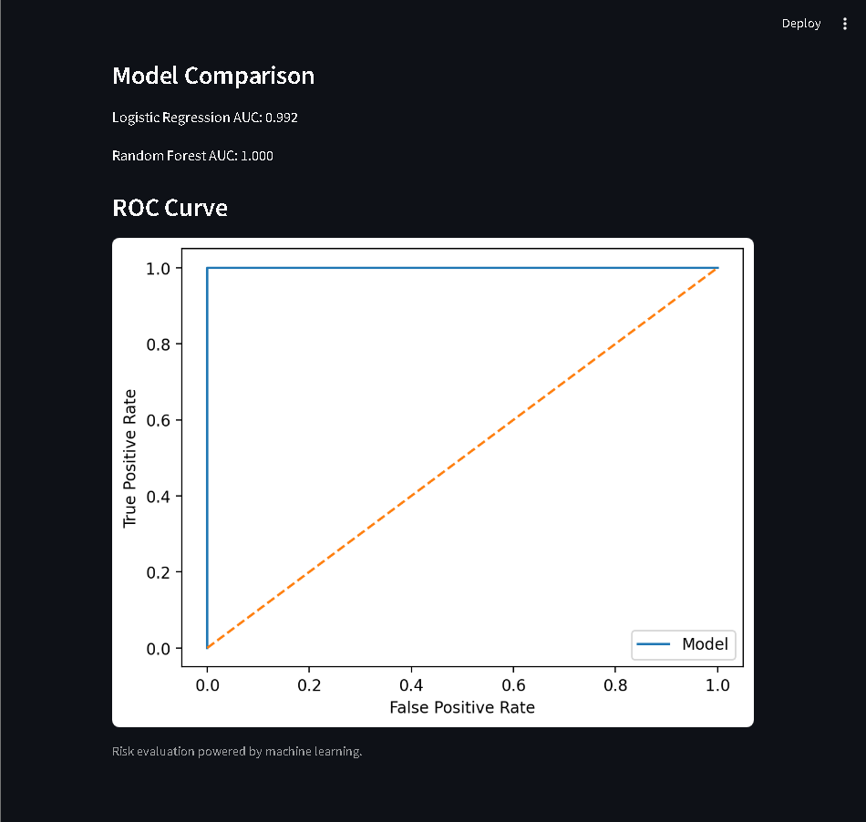

# Credit Risk AI | Credit Risk Decision System

Credit Risk AI is a machine learning application designed to estimate default probability, generate a credit risk score, and support loan approval decisions.

The project focuses on translating model predictions into clear and consistent business decisions, instead of treating prediction as the final output.

---

## Live Demo

https://credit-risk-ai-livduk4ttdjaeyvx8vl5h6.streamlit.app/

---

## Project Overview

Credit risk assessment is a core process in financial services, fintech, banking, and lending operations.

The goal of this project is to simulate a simplified credit risk workflow where applicant information is processed by a machine learning model and converted into an actionable decision.

The application allows users to:

- Enter applicant information.
- Estimate probability of default.
- Generate a credit risk score.
- Receive a decision recommendation.
- Review the main variables influencing the result.
- Compare model performance.

---

## Application Preview



---

## Risk Evaluation Example



---

## Model Evaluation



---

## Problem Context

Credit risk models are commonly used to estimate the probability that an applicant may default on a loan or credit product.

In a real-world environment, a model is expected to support more than a binary prediction. It should help translate risk into decisions that are consistent, explainable, and useful for business operations.

This project simulates that process by combining:

- Probability of default estimation.
- Credit score generation.
- Approval, review, or rejection decision logic.
- Basic feature-level explanation.
- Model performance comparison.

---

## Machine Learning Approach

The project follows a structured machine learning workflow:

1. Data preprocessing and feature preparation.
2. Training of multiple classification models.
3. Model comparison using ROC AUC.
4. Selection of the best-performing model.
5. Probability-based prediction.
6. Conversion of probability into a credit score.
7. Business-rule decision layer.

The goal is not only to train a model, but to build a decision-oriented system that resembles how credit scoring tools are used in practice.

---

## Models Used

Two classification models are trained and compared:

| Model | Purpose |
|---|---|
| Logistic Regression | Baseline model with stronger interpretability |
| Random Forest Classifier | Non-linear model for improved predictive performance |

The final model is selected based on validation performance.

---

## Risk Scoring Logic

The predicted probability of default is converted into a credit score.

The score follows a simplified credit scoring scale:

| Score Range | Interpretation |
|---|---|
| 300 - 579 | High risk |
| 580 - 699 | Medium risk |
| 700 - 850 | Lower risk |

Higher scores indicate lower estimated credit risk.

This makes the output easier to interpret for business users compared with raw probabilities.

---

## Decision Logic

The system applies a decision layer on top of the model prediction.

| Decision | Condition |
|---|---|
| Loan Approved | Low probability of default |
| Manual Review | Medium probability of default |
| Loan Rejected | High probability of default |

This separation between prediction and decision is important in real systems, where business rules and risk policies are usually applied after the model generates a probability.

---

## Model Performance

The application compares model performance using ROC AUC.

Current validation results displayed by the application:

| Model | ROC AUC |
|---|---:|
| Logistic Regression | 0.992 |
| Random Forest | 1.000 |

The model shows high performance on the prepared dataset. These results should be interpreted as part of a portfolio project and not as production-ready validation.

Future improvements should include:

- Validation with larger datasets.
- Out-of-sample testing.
- Monitoring for overfitting.
- Bias and fairness review.
- Cost-sensitive evaluation.
- Additional metrics such as precision, recall, F1-score, and confusion matrix analysis.

---

## Explainability

The application provides a basic explanation of each prediction by ranking the variables that most influenced the decision.

This is not a full explainability framework, but it helps communicate which applicant features contributed most to the estimated risk.

Potential future improvements include:

- SHAP values.
- Feature contribution charts.
- Reason codes for underwriting decisions.
- Risk factor grouping.

---

## Key Features

- Credit risk classification.
- Probability of default estimation.
- Credit score generation.
- Approval, review, or rejection recommendation.
- Logistic Regression and Random Forest comparison.
- ROC curve visualization.
- Basic prediction explanation.
- Interactive Streamlit interface.

---

## Tech Stack

- Python
- pandas
- NumPy
- scikit-learn
- Streamlit
- matplotlib
- joblib

---

## Project Structure

```text
credit-risk-ai/
├── app.py
├── README.md
├── requirements.txt
├── src/
│   └── model.py
├── data/
│   └── credit_clean.csv
├── images/
│   ├── credit-risk-app-preview.png
│   ├── credit-risk-evaluation-result.png
│   └── credit-risk-roc-curve.png
├── outputs/
│   └── models/
└── notebooks/
```

---

## Run Locally

Clone the repository:

```bash
git clone https://github.com/camargoluisenrique/credit-risk-ai.git
cd credit-risk-ai
```

Create and activate a virtual environment:

```bash
python -m venv venv
```

On Windows PowerShell:

```bash
.\venv\Scripts\Activate.ps1
```

Install dependencies:

```bash
pip install -r requirements.txt
```

Run the application:

```bash
streamlit run app.py
```

---

## Repository

https://github.com/camargoluisenrique/credit-risk-ai

---

## Future Improvements

- Deploy a stable production demo.
- Add SHAP-based explainability.
- Add confusion matrix and classification report to the interface.
- Add applicant profiles for scenario testing.
- Add FastAPI endpoint for credit scoring.
- Add model monitoring logic.
- Add Docker support.
- Improve validation with additional datasets.

---

## Author

Luis Enrique Camargo Rangel  
Data Scientist Jr. | Machine Learning | Python | SQL  

GitHub: https://github.com/camargoluisenrique